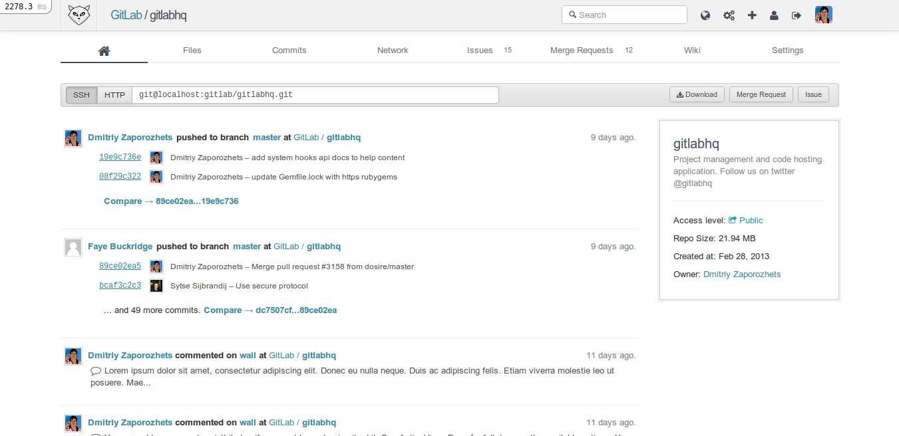
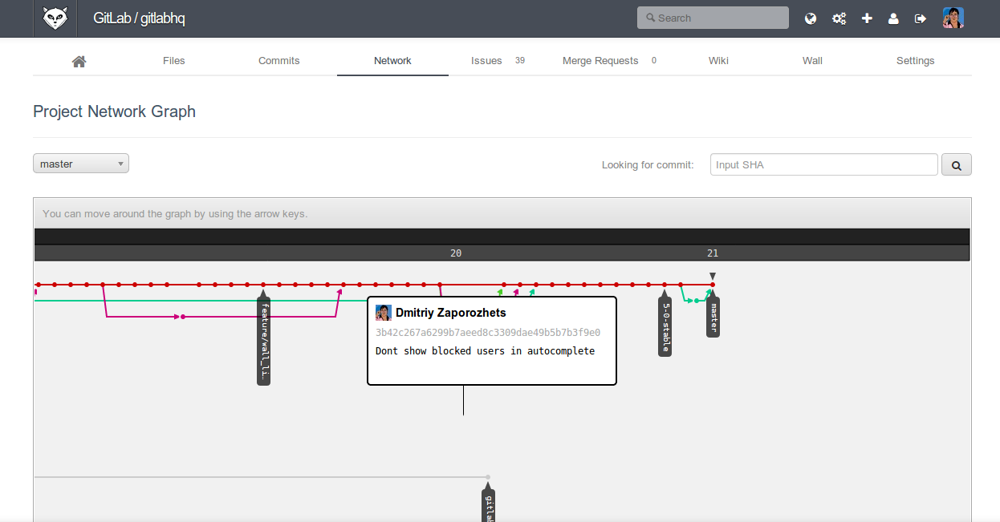

!SLIDE center cover
#source control

!SLIDE
# problemen opgelost door source control
* hoe weet ik wanneer iemand iets gedaan heeft
* hoe weet ik waarom iemand iets gedaan heeft
* hoe weet iemand anders waarom ik iets gedaan heb
* wat is er gewijzigd sinds..
* hoe krijg ik de laatste versie binnen

!SLIDE
# soorten source control
* distributed
* non-distributed (centralized)

!SLIDE
# distributed source control
## werkwijze
* developers werken lokaal (copy/branch)
* wijzigingen delen door repositories/developers
* focus: wijzigingen delen (patches)

## voordelen
* geen centrale server (SPOF)
* minder disk usage

.notes single point of failure

!SLIDE
# centralized source control
## werkwijze
* developer pushen/pullen naar centrale server
* focus: syncing, tracking, backing up
## voordelen
* snel
* merging gaat makkelijk
* offline werken (beperkt)

!SLIDE
# verschillende oplossing
* git (voorkeur)
* svn
* mercurial
* arch

!SLIDE
# gitlab
git management software voor projecten

!SLIDE center cover

!SLIDE center cover

