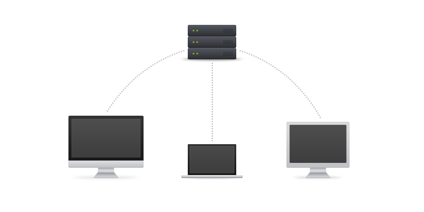
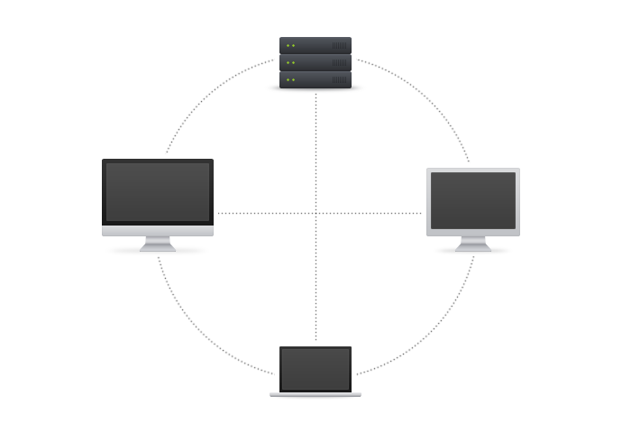

!SLIDE center cover
#version control

!SLIDE
# problemen opgelost door version control
* wie
* wat
* waar
* wanneer
* waarom
* hoe
* laatste versie

!SLIDE
# soorten version control
* non-distributed (centralized)
* distributed

!SLIDE center
# centralized version control

!SLIDE
# centralized version control
## werkwijze
* centrale server
* single point of failure
* eerder traag
* ongevraagde wijzigingen -> build fail voor iedereen
* braching/mergen is vaak moeilijk

!SLIDE center
# distributed version control

!SLIDE
# distributed version control
## werkwijze
* developers werken lokaal, commits
* snel
* offline
* branching/mergen gaat makkelijk

!SLIDE
# diverse oplossingen
* git (voorkeur)
* mercurial
* svn
* arch

!SLIDE
# gitlab
git management software voor projecten

!SLIDE center

!SLIDE center cover

