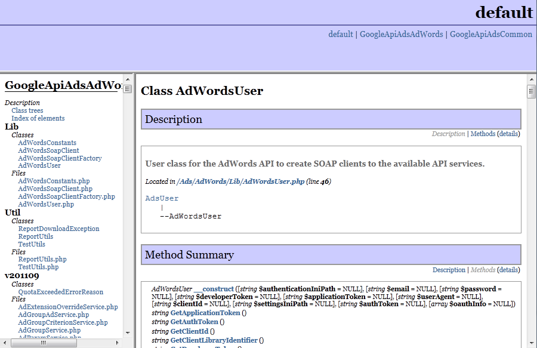

!SLIDE center cover
# documentatie

!SLIDE
# wanneer **GEEN** commentaar schrijven
nutteloze commentaar

    @@@ php
    // find the needle in a heap
    public function findNeedleInHeap(Needle $needle, Heap $heap) { .. }

    // print the given name
    public function printName($name) { .. }

    /**
     * Get the bank account
     */
     public function getBankAccount() { .. }

.notes commentaar is waardeloos, functie is overduidelijk

!SLIDE
# wanneer **GEEN** commentaar schrijven
slechte functie benaming

    @@@ php
    // Remove items from the Reply as stated in the Request
    // this can be, the number of items returned, total byte size, etc..
    public function cleanReply(Request $request, Reply $reply) { .. }

    // Make sure 'reply' meets the count/byte/etc. limits from the request
    public function enforceLimitsFromRequest(Request $requst, Reply $reply) { .. }

.notes wat betekend clean? wat wordt er gecleaned?

!SLIDE
# wanneer WEL commentaar schrijven
manier van denken

    @@@ php
    // This class is getting messy. Maybe we should create a seperate 'Address' class

    // Looping over these objects seems much faster than using array_map

    // Looks weird, but this is the best solution, see: [link to stackoverflow]

.notes niet iedereen ziet meteen waarom een keuze gemaakt is

!SLIDE
# wanneer WEL commentaar schrijven
gebreken in code

    @@@ php
    // TODO: use a faster algorithm

    // TODO(joeri): this should also handle other image formats besides JPEG

!SLIDE
# wanneer WEL commentaar schrijven
gebreken in code

* TODO: wat nog gedaan moet worden
* FIXME: defecte code
* HACK: toegeving onbevallige oplossing voor probleem
* XXX: gevaar! ernstig probleem hier

.notes handig om project search te doen

!SLIDE
# wanneer WEL commentaar schrijven
constanten

    @@@ php
    const IMAGE_QUALITY = 0.72; // gave the best size/quality tradeoff

    const MAX_NUM_THREADS = 8; // should be >= (2 * number of processors)

    const MAX_IMAGE_SIZE_KB = 500;

!SLIDE
# wanneer WEL commentaar schrijven
samenvatten

    @@@ php
    // zoek alle item die de klant zelf aangekocht heeft
    for ( .. ) {
        for ( .. ) {
            for ( .. ) {
                ..
            }
        }
    }

.notes opmerking: 3 nested for loops zijn evil

!SLIDE
# samenvatting
* manier van denken uit leggen
* gebreken in code
* constanten
* samenvatten
* onduidelijke code
* uitzonderlijke beslissingen
* algemeen doel van een class

!SLIDE
# hulpmiddelen
DocBlock (vgl. Javadoc)

    @@@ php
     /**
      * This is the short description for a DocBlock.
      *
      * This is the long description for a DocBlock. This text may contain
      * multiple lines and even some _markdown_.
      *
      * * Markdown style lists function too
      * * Just try this out once
      *
      * The section after the long description contains the tags; which provide
      * structured meta-data concerning the given element.
      *
      * @author  Joeri Verdeyen <info@jverdeyen.be>
      *
      * @since 1.0
      *
      * @param int    $example  This is an example function/method parameter description.
      * @param string $example2 This is a second example.
      */

!SLIDE
# hulpmiddelen
* phpDocumentor
* phpdox
* DocBook (End User)

.notes DocBook: hoe de code gebruiken, andere: wat code doet

!SLIDE center
# phpDocumentor

