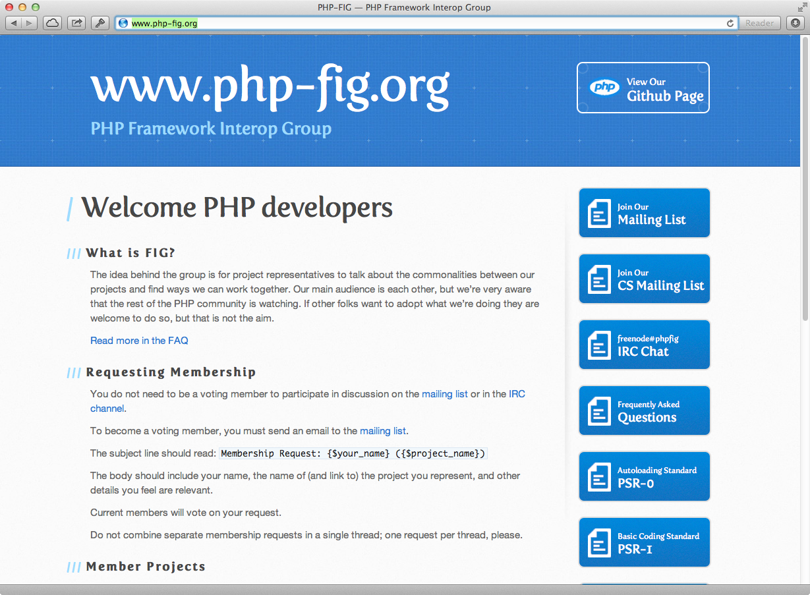
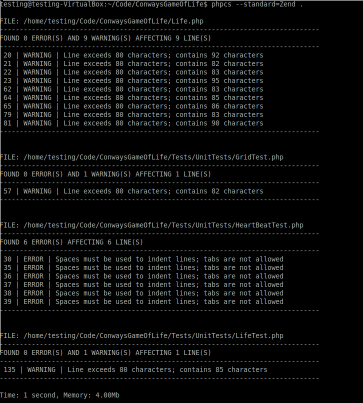
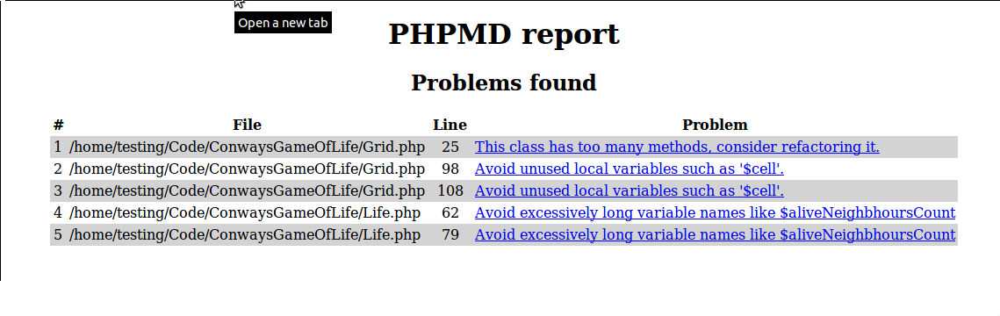

!SLIDE center cover
# coding standards and conventies

!SLIDE
# waarom?
* focus op code, niet op formattering
* consistentie
* leesbaarheid
* betere samenwerking
* onderhoud

!SLIDE
# wat?
* naamconventies (file, class, variable)
* codeopmaak
* richtlijnen voor consistentie in de code
* gelijkmatigheid

!SLIDE
# ga zelf geen standard uitvinden
* gebruik een bestaande, keuze genoeg
    * outsourcing
    * externe vs. interne standard
    * libraries
* blijf bij je keuze

!SLIDE
PHP-FIG

!SLIDE
# PHP-FIG
PSR: "PHP Standards Recommendation"

* PSR-0: autoloading standard
* PSR-1: basic coding standard
* PSR-2: coding style standard
* PSR-3: logger interface

!SLIDE center
# handige tools

!SLIDE center
## PHP CodeSniffer
detecteer inbreuk tegen specifieke standard

!SLIDE center
## PHP-CS-Fixer
fix inbreuk tegen specifieke standard

!SLIDE center
## PHP Mess Detector
detecteer mogelijke problemen, ongebruikte code

