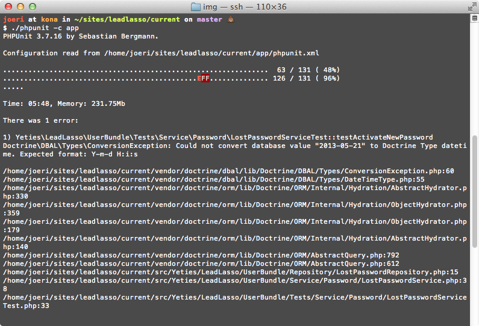
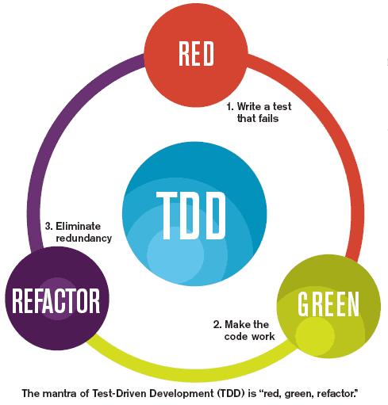

!SLIDE center cover
# testing

!SLIDE
# testing
* niet geteste code is breekbaar
* ipv debuggen in de browser (var_dump)
* belangrijkste aspecten testen
* phpunit, meest gebruikte testing framework

.notes klein voorbeeldje tonen

!SLIDE center
# PHPUnit
meeste gebruikte testing framework

!SLIDE center
# Test Driven Development (TDD)

!SLIDE
# Test Driven Development (TDD)
* schrijf eerst je tests
* laat de tests falen
* schrijf code tot tests slagen
* refactor code en herhaal
