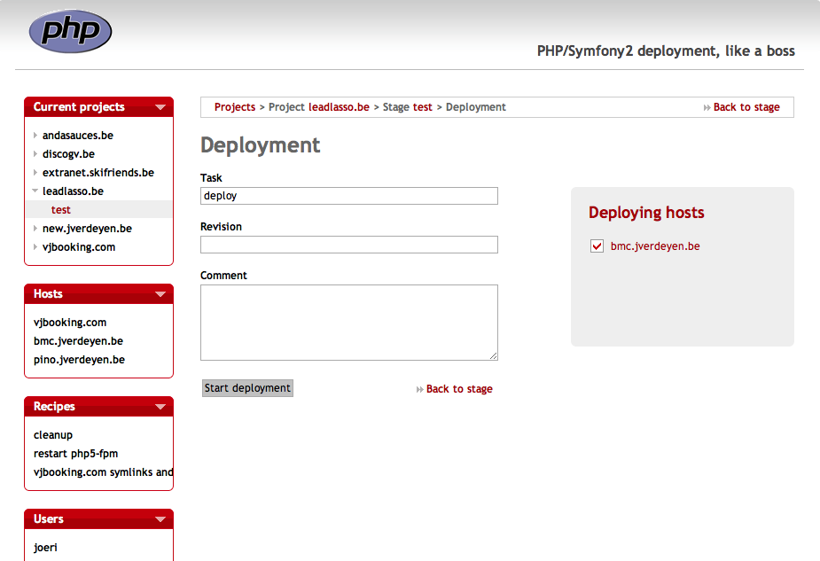

!SLIDE center cover
# deployment

!SLIDE
# deployment
* code naar productie
* steeds dezelfde acties automatiseren
* one click -> code live
* rollback

!SLIDE
# deployment tips
* bewerk nooit op de live server
* deploy met repostory tags (bv tag 1.0)
* gebruik een staging environment
* vaste procedure voor releases

.notes altijd 1 versie op meerdere servers, weet welke versie live staat, apc opcode

!SLIDE center
# deploy tools
Webistrano

!SLIDE
# deploy tools
* Capistrano
* Phing
* chiefphp
* git
* rsync