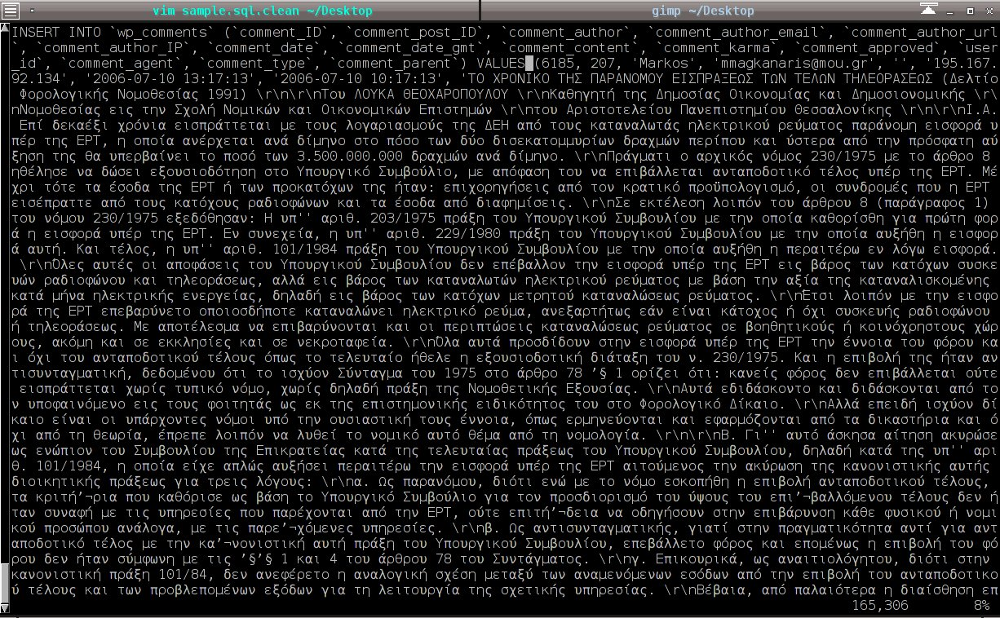

!SLIDE center cover
# PHP en UTF-8

!SLIDE center
# UTF-8 in PHP sucks!

!SLIDE
# waarom?
* geen low-level support voor Unicode in PHP
* opletten van SQL tot HTML

!SLIDE
# waarom ?
multibyte string functies

    @@@ php
    mb_strlen() vs. strlen()
    mb_substr() vs. substr()
    ..

!SLIDE
# tip
bovenaan php file

    @@@ php
    // Set internal character encoding to UTF-8
    mb_internal_encoding("UTF-8");

    // Display current internal character encoding
    echo mb_internal_encoding();

vlak voor output

    @@@ php
    // Tell PHP that we output UTF-8 to broweser
    mb_http_output("UTF-8");

