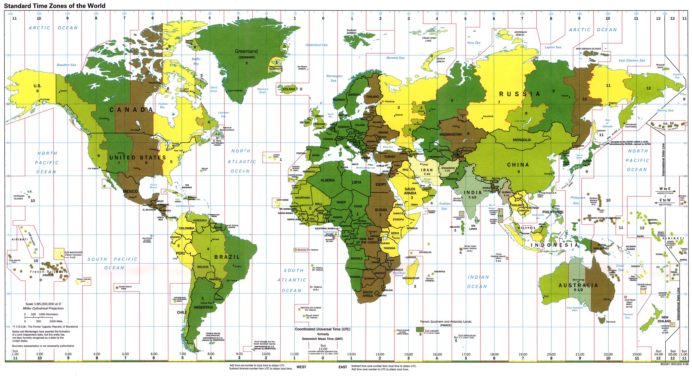

!SLIDE center cover
# DateTime

!SLIDE
# vroeger

    @@@ php
    date();
    gmdate();
    date_timezone_set();
    strtotime();

# nu

    @@@ php
    $date = new DateTime('yesterday');
    $date->format('Ymd');
    $date->setTimeZone(new DateTimeZone('Europe/Brussels'));

.notes Coordinated Universal Time (UTC) is the primary time standard by which the world regulates clocks and time

!SLIDE
# DateTime vergelijken

    @@@ php
    $date = new DateTime('yesterday');

    $later = new DateTime('2012-05-20', new DateTimeZone('UTC'));

    if ($date > $later) { .. }

    $difference = $date->diff($later);

    echo $difference['days'];