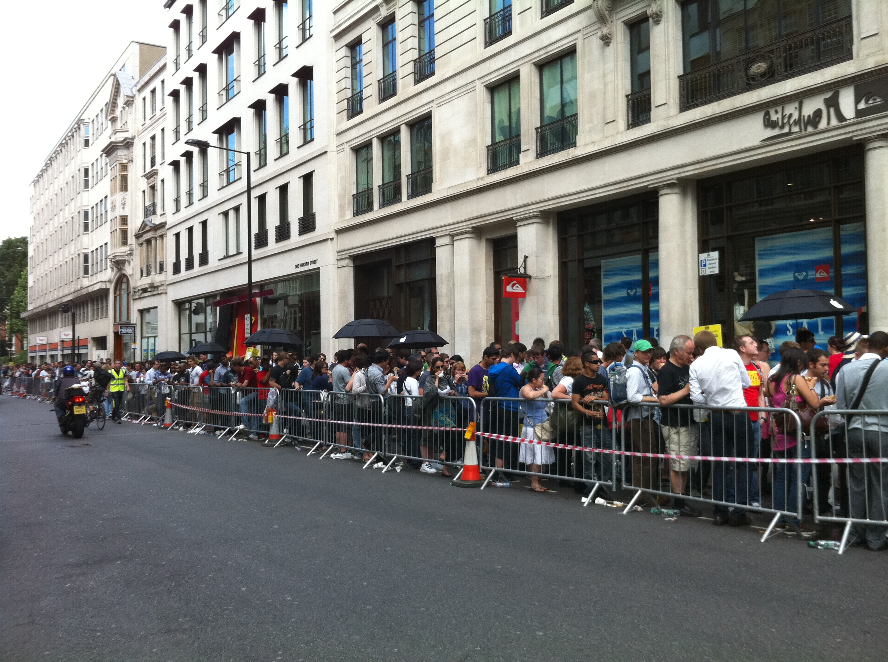

!SLIDE center cover

# in_array()

!SLIDE
# mysterie in_array()

    @@@ php
    $array = array (
        'lion' => true,
        'rhino' => true,
        'tiger' => false
    );

    in_array('tiger', $array);

.notes true, raar, want in_array checked op waarde

!SLIDE
# mysterie in_array()

    @@@ php
    $array = array (
        'lion' => 1,
        'rhino' => 1,
        'tiger' => 0
    );

    in_array('cat', $array);

    'cat' == 0; // true

.notes standaard checked in_array op loose comparison

!SLIDE
# gelijk in PHP, bij ==
* 0
* false
* ""
* "0"
* NULL of null
* array()

!SLIDE
# mysterie in_array()
oplossing, strict vergelijken

    @@@ php
    $array = array (
        'lion' => 1,
        'rhino' => 1,
        'tiger' => 0
    );

    in_array('cat', $array, true); // false
