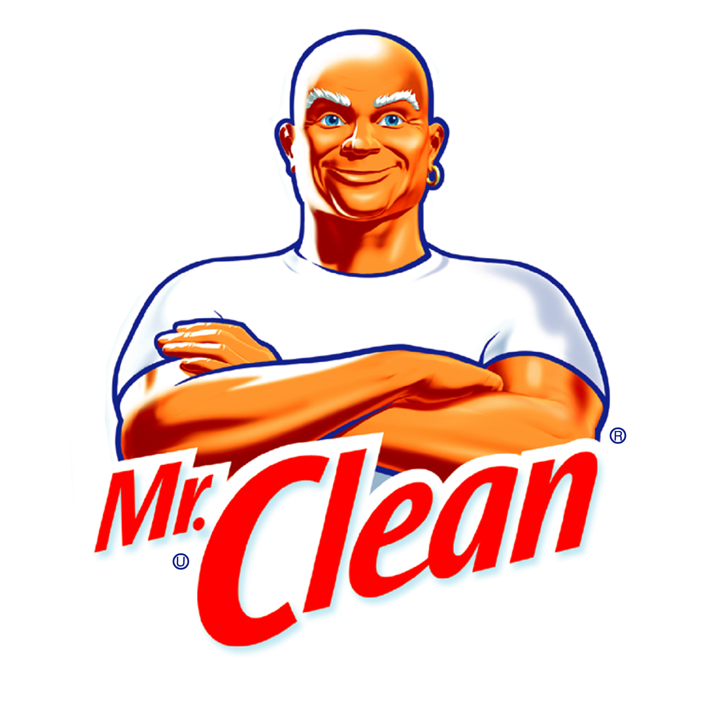

!SLIDE center cover
# data validation en sanitization

!SLIDE
# golden rule
* vertrouw NOOIT gebruikers input
* validate/sanitize alle user input en escape output

!SLIDE
# data validation
* zeker zijn dat we opslaan wat we willen opslaan
* accept/reject

# data sanitization
* zeker zijn dat data onschadelijk is voor we het opslaan of tonen
* strip/encode

!SLIDE
# waarom?
sql injection, XSS (Cross-site Scripting)

    @@@ javascript
    alert('hacked');
    alert(document.cookie);

!SLIDE
# waarom?
* kan alle output omzeep helpen
    * bv. single en double quote
* malware

!SLIDE
# sanitize html, input en output
* htmlentities()
    * niet strip_tags()
    * niet filter_var()
* HTML Purifier

.notes strip_tags (dumb, als je <> vergeet), fitler_var -> line breaks (ascii, max 32bit)

!SLIDE
# sanitize html, input en output
* htmlentities()
    * simpel
    * snel
    * geen validatie
* HTML Purifier
    * complex
    * traag bij zeer complexe html

!SLIDE
# sanitize html, input en output
htmlentities

    @@@ php
    // evil html van een formulier
    $evilHtml = '
Mua-ha-ha!  Twiddling my evil mustache...
';

    $safeHtml = htmlentities($evilHtml, ENT_QUOTES, 'UTF-8');

.notes ENT_QUOTES voor quotes (double/single), force utf-8 (standaard vanaf 5.4), htmlspecialchars -> zet bv & om naar &amp;

!SLIDE
# sanitize html, input en output
HTML Purifier

    @@@ php
    require_once('htmlpurifier-4.4.0/HTMLPurifier.auto.php');

    $evilHtml = '
Mua-ha-ha!  Twiddling my evil mustache...
';

    $purifier = new HTMLPurifier(HTMLPurifier_Config::createDefault());

    $safeHtml = $purifier->purify($evilHtml);
