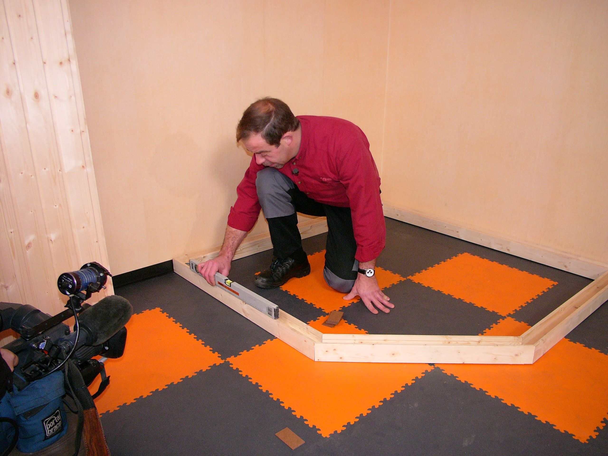

!SLIDE center cover
# handige functies

!SLIDE
# array_rand

    @@@ php
    $sites = ["Scott", "Trek", "Kona", "Orbea"];
    $k = array_rand($sites);
    $sites[$k];

.notes 2e param bepaald aantal keys

!SLIDE
# basename

    @@@ php
    $path = '/home/user/site/www/index.php';
    $filename1 = basename($path); // index.php
    $filename2 = basename($path, '.php'); // index

!SLIDE
# list

    @@@ php
    $array = ["Steve", "Jobs"];
    list($firstName, $lastName) = $array;

    echo $firstName; // Steve
    echo $lastName; // Jobs

met explode

    @@@ php
    $data = "foo:*:1023:1000::/home/foo:/bin/sh";
    list($user, $pass, $uid, $gid, $gecos, $home, $shell) = explode(":", $data);

.notes /etc/passwd output

!SLIDE
# range

    @@@ php
    range(0, 10); // array(0, 1, 2, 3, 4, 5, 6, 7, 8, 9, 10)
    range('a', 'f'); // array('a', 'b', 'c', 'd', 'e'. 'f');

    range(2, 10, 2); // array(2, 4, 6, 8, 10);

!SLIDE
# is_readable

    @@@ php
    $filename = 'test.txt';

    if (is_readable($filename)) {
        echo 'The file is readable';
    } else {
        echo 'The file is not readable';
    }